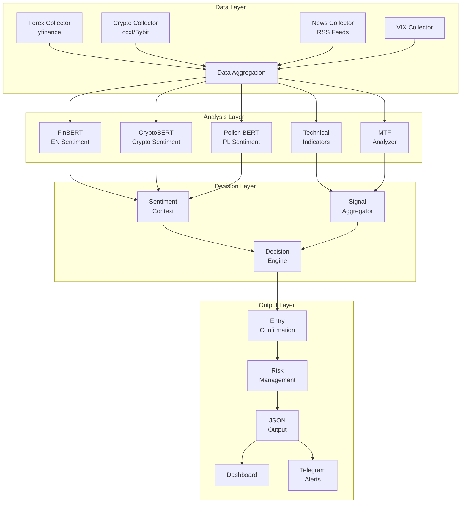

# 📈 Trading Decision System

[](https://github.com/hubertdomagalaa/TraidingSystem_Forex_Crypto/actions/workflows/test.yml)
[](https://codecov.io/gh/hubertdomagalaa/TraidingSystem_Forex_Crypto)
[](https://opensource.org/licenses/MIT)
[](https://www.python.org/downloads/release/python-3110/)
[](https://nextjs.org/)
[](https://www.typescriptlang.org/)

<div align="center">

**Multi-model ML trading signal generator** combining NLP sentiment analysis with technical indicators for Forex and Cryptocurrency markets.

[🚀 Quick Start](#-quick-start) • [📊 Features](#-features) • [🖥️ Dashboard](#️-dashboard) • [📖 Documentation](#-documentation)

</div>

---

## 🎯 What is this?

Trading Decision System is a sophisticated **trading signal recommendation engine** that combines:

- **🤖 NLP Sentiment Analysis** — FinBERT, CryptoBERT, and Polish BERT for multi-language news analysis
- **📈 Technical Analysis** — RSI, MACD, VWAP, ADX, Bollinger Bands, Pivot Points
- **🕐 Multi-Timeframe Analysis** — 1H/4H/1D alignment for trend confirmation
- **⚠️ Risk Management** — ATR-based Stop Loss/Take Profit with position sizing
- **✅ Entry Confirmation** — Requires 4/7 conditions before generating entry signal

> ⚠️ **Important**: This system generates **recommendations only**. It does NOT execute trades automatically. All trading decisions are made manually by the user on XTB (Forex) and Bybit (Crypto).

---

## 🖥️ Dashboard

<div align="center">

### Real-Time Trading Dashboard
*Glassmorphism UI with live signal updates, VIX monitoring, and Fear & Greed Index*

</div>

### Dashboard Features

| Feature | Description |
|---------|-------------|
| **Signal Card** | Real-time LONG/SHORT/HOLD signals with entry, SL, TP levels |
| **VIX Gauge** | Market volatility monitoring with color-coded alerts |
| **Fear & Greed Meter** | Crypto market sentiment indicator |
| **MTF Table** | Multi-timeframe trend analysis (1H/4H/1D) |
| **Entry Checklist** | Visual confirmation of 7 entry conditions |
| **Risk Panel** | Day limit monitoring and position sizing |

---

## 📊 Features

| Feature | Description |
|---------|-------------|
| 🤖 **ML Sentiment** | FinBERT, CryptoBERT, Polish BERT for news analysis |
| 📊 **Technical Analysis** | RSI, MACD, Bollinger Bands, ATR, VWAP, Pivot Points |
| 🕐 **Multi-Timeframe** | 1H/4H/1D alignment with trend confirmation |
| ✅ **Entry Confirmation** | 4/7 conditions required before entry signal |
| 💰 **Risk Management** | ATR-based SL/TP, position sizing, daily limits |
| ⚡ **Real-time Dashboard** | Next.js + Streamlit interfaces |
| 🔔 **Alerts** | Telegram notifications for signals |
| 🐳 **Docker Ready** | One-command deployment |
| 🧪 **Backtesting** | Strategy validation framework |

---

## 🏗️ Architecture



---

## 🚀 Quick Start

### Prerequisites

- **Python 3.11+** — ML backend
- **Node.js 18+** — Next.js dashboard
- **Docker** (optional) — containerized deployment

### Step 1: Clone & Install

```bash
# Clone the repository
git clone https://github.com/hubertdomagalaa/TraidingSystem_Forex_Crypto.git
cd TraidingSystem_Forex_Crypto

# Create virtual environment
python -m venv venv
source venv/bin/activate  # Windows: venv\Scripts\activate

# Install Python dependencies
pip install -r requirements.txt

# Copy environment file
cp .env.example .env
```

### Step 2: Configure Environment

Edit `.env` with your API keys (optional for basic usage):
```bash
TELEGRAM_BOT_TOKEN=your_telegram_token     # For alerts
TELEGRAM_CHAT_ID=your_chat_id
FRED_API_KEY=your_fred_key                 # Economic data
```

### Step 3: Run Analysis

```bash
# Run main analysis (generates trading signals)
python main.py

# Or run short-term trading analysis
python run_short_term.py

# Run backtesting
python run_backtest.py
```

### Step 4: Launch Dashboard

```bash
# Option A: Next.js Dashboard (recommended)
cd dashboard-web
npm install
npm run dev
# Open http://localhost:3000

# Option B: Streamlit Dashboard
streamlit run dashboard/app.py
# Open http://localhost:8501
```

### Step 5: Docker Deployment (Alternative)

```bash
docker-compose up -d

# Access:
# - API: http://localhost:8000
# - Dashboard: http://localhost:3000
```

---

## 🎯 How to Use This System

```
┌─────────────────────────────────────────────────────────────────┐
│  1. RUN ANALYSIS                                                │
│     python run_short_term.py                                    │
│     → Fetches market data, analyzes sentiment, generates signal │
└─────────────────────┬───────────────────────────────────────────┘
                      ▼
┌─────────────────────────────────────────────────────────────────┐
│  2. REVIEW DASHBOARD                                            │
│     http://localhost:3000                                        │
│     → See signal direction, confidence, entry/SL/TP levels     │
└─────────────────────┬───────────────────────────────────────────┘
                      ▼
┌─────────────────────────────────────────────────────────────────┐
│  3. EXPORT TO LLM (Optional)                                    │
│     Click "Copy JSON for LLM" in dashboard                      │
│     → Paste to Claude/ChatGPT for additional analysis           │
└─────────────────────┬───────────────────────────────────────────┘
                      ▼
┌─────────────────────────────────────────────────────────────────┐
│  4. MANUAL EXECUTION                                            │
│     Execute trade on XTB (Forex) or Bybit (Crypto)              │
│     → Use provided entry, stop loss, and take profit levels     │
└─────────────────────────────────────────────────────────────────┘
```

---

## 📁 Project Structure

```
TradingSystem/
├── config/                  # Configuration files
│   ├── settings.py              # Main settings
│   ├── short_term_config.py     # Day/swing trading params
│   ├── trading_sessions.py      # Session definitions
│   └── model_weights.py         # ML model weights
├── data/                    # Data collection
│   └── collectors/              # Market data collectors
├── models/                  # ML models
│   ├── huggingface/             # FinBERT, CryptoBERT, Polish BERT
│   ├── technical/               # Technical indicators
│   └── ensemble/                # Meta-model
├── strategies/              # Trading strategies
│   ├── entry_confirmation.py    # 7-condition entry system
│   └── forex/, crypto/          # Market-specific strategies
├── aggregator/              # Signal aggregation
├── risk_management/         # Position sizing, SL/TP
├── core/                    # Core decision engine
├── api/                     # FastAPI backend
├── dashboard/               # Streamlit UI
├── dashboard-web/           # Next.js UI (recommended)
├── alerts/                  # Telegram notifications
├── backtesting/             # Strategy testing
├── tests/                   # Unit tests
└── docs/                    # Documentation
```

---

## 📊 API Reference

### REST Endpoints

| Method | Endpoint | Description |
|--------|----------|-------------|
| `GET` | `/` | Health check |
| `GET` | `/signals` | Get current trading signals |
| `GET` | `/analysis/{pair}` | Get analysis for specific pair |
| `GET` | `/session` | Get current session info |
| `POST` | `/analyze` | Run full analysis |

### Example Signal Response

```json
{
  "pair": "EUR/PLN",
  "action": "LONG",
  "confidence": 0.857,
  "entry": 4.3500,
  "stop_loss": 4.3260,
  "take_profit": 4.3980,
  "risk_reward": 2.0,
  "confirmations": {
    "achieved": 6,
    "required": 4,
    "details": ["trend_1h_up", "price_above_vwap", "adx_ok", "rsi_not_overbought", "sentiment_positive", "trend_4h_aligned"]
  },
  "mtf_analysis": {
    "1h": {"trend": "up", "strength": 0.65},
    "4h": {"trend": "up", "strength": 0.45},
    "1d": {"trend": "sideways", "strength": 0.20}
  }
}
```

---

## ⚙️ Configuration

### Risk Management Settings

| Parameter | Default | Description |
|-----------|---------|-------------|
| `FOREX_SL_MULTIPLIER` | 1.2 | Stop Loss = ATR × 1.2 |
| `FOREX_TP_MULTIPLIER` | 2.4 | Take Profit = ATR × 2.4 (R:R = 1:2) |
| `CRYPTO_SL_MULTIPLIER` | 1.5 | Higher for crypto volatility |
| `CRYPTO_TP_MULTIPLIER` | 3.0 | R:R = 1:2 |
| `MAX_DAILY_LOSS` | 3% | Stop trading after 3% daily loss |
| `MAX_TRADES_PER_DAY` | 5 | Maximum trades per day |

### Entry Confirmation Conditions

The system requires **minimum 4 of 7 conditions** before generating an entry signal:

| # | Condition | Description |
|---|-----------|-------------|
| 1 | `trend_1h_up/down` | 1H timeframe trend direction |
| 2 | `trend_4h_aligned` | 4H not opposing signal direction |
| 3 | `price_above/below_vwap` | Price position vs VWAP |
| 4 | `rsi_not_overbought/oversold` | RSI within acceptable range |
| 5 | `sentiment_positive/negative` | ML sentiment > 0.15 threshold |
| 6 | `not_in_avoid_time` | Not in low-liquidity period |
| 7 | `adx_ok` | ADX > 15 (trend strength) |

---

## 🧪 Testing

```bash
# Run all tests
pytest tests/ -v

# Run with coverage
pytest tests/ -v --cov=. --cov-report=term-missing --cov-report=html

# Run specific test file
pytest tests/test_entry_confirmation.py -v
```

---

## 📈 Supported Markets

### Forex Pairs
- EUR/PLN, EUR/USD, USD/PLN
- GBP/USD, USD/JPY (extendable)

### Cryptocurrencies
- BTC/USDT, ETH/USDT
- Additional pairs configurable in `config/crypto_assets.py`

---

## 🔧 Tech Stack

| Category | Technologies |
|----------|-------------|
| **Core** | Python 3.11, FastAPI, Uvicorn |
| **ML/NLP** | Hugging Face Transformers, FinBERT, CryptoBERT, Polish BERT |
| **Frontend** | Next.js 14, React 18, TypeScript, Tailwind CSS 4 |
| **Data** | yfinance, ccxt, pandas, numpy |
| **Testing** | pytest, unittest |
| **DevOps** | Docker, GitHub Actions |

---

## 📖 Documentation

- [System Documentation](docs/SYSTEM_DOCUMENTATION_FOR_LLM_REVIEW.md) — Detailed technical documentation (700+ lines)
- [Contributing Guide](CONTRIBUTING.md) — How to contribute to this project
- [Architecture Overview](docs/ARCHITECTURE.md) — System layers and canonical API contract
- [Runbook](docs/RUNBOOK.md) — Operational troubleshooting and recovery playbooks
- [Quality Gates](docs/QUALITY_GATES.md) — Mandatory backend/frontend CI checks
- [ADR 0001](docs/ADR/0001-canonical-api-contract.md) — Decision on canonical API contract
- [Sexy Repo Review Blueprint](docs/SEXY_REPO_REVIEW.md) — How to present the repo for a strong first impression

---

## 🤝 Contributing

Contributions are welcome! Please read our [Contributing Guide](CONTRIBUTING.md) for details on:
- Code style and linting requirements
- Pull request process
- Testing requirements

---

## 📄 License

This project is licensed under the MIT License - see the [LICENSE](LICENSE) file for details.

---

## ⚠️ Disclaimer

**IMPORTANT**: This system is for educational and analytical purposes only. It does not constitute financial advice.

- Trading involves significant risk of loss
- Past performance does not guarantee future results
- Always do your own research before trading
- Never trade with money you cannot afford to lose

---

<div align="center">

**Built with ❤️ using Python, Hugging Face Transformers, FastAPI, and Next.js**

[⬆ Back to Top](#-trading-decision-system)

</div>
